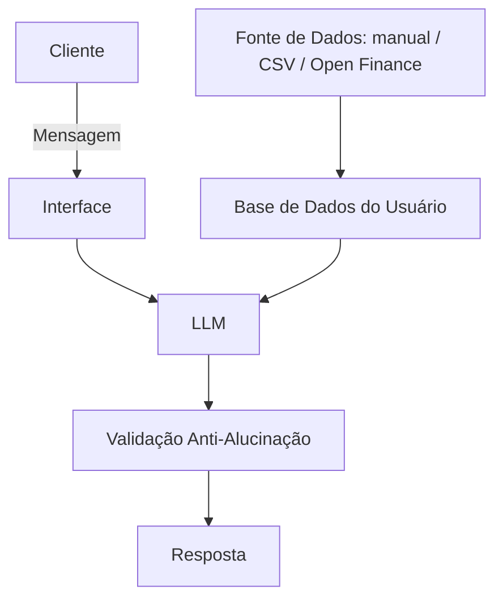

# agente-financeiro-jarbas

# Documentação do Agente — Jarbas

## Contexto do Desafio
> Este projeto responde a um desafio de criação de uma experiência digital de relacionamento financeiro, guiada por IA generativa e fundamentada em boas práticas de UX. A solução integra compreensão de linguagem natural, respostas contextualizadas e simulações simples, consolidando o aprendizado em IA, Python, dados e UX, com foco em interações claras, seguras e personalizadas.

---

## Caso de Uso

### Problema
> Qual problema financeiro seu agente resolve?

Falta de visibilidade sobre os próprios gastos: no dia a dia, as pessoas não sabem com clareza onde e quanto estão gastando.

### Solução
> Como o agente resolve esse problema de forma proativa?

O Jarbas processa os gastos do usuário — inseridos manualmente no MVP e, futuramente, importados via extrato ou sincronizados com Open Finance — e entrega um resumo automático ao final do dia. O usuário também pode conversar com o agente para tirar dúvidas sobre os próprios gastos, sempre com respostas baseadas apenas nos dados que ele realmente tem disponíveis.

### Público-Alvo
> Quem vai usar esse agente?

Pessoas em busca de organização financeira que querem entender onde estão gastando o dinheiro.

---

## Escopo

### MVP (v0–v1)
- Cadastro manual de gastos (valor, categoria, data) ou importação de extrato (CSV/OFX)
- Categorização automática simples
- Resumo diário/semanal por categoria
- Alertas de limite de gasto por categoria
- Chat para perguntas sobre os dados já cadastrados

### Visão Futura
- Integração com Open Finance via agregador (ex: Pluggy, Celcoin), evitando o processo de certificação direta como participante do Open Finance Brasil
- Persistência de contexto entre conversas
- Simulações financeiras simples (ex: "quanto eu economizaria reduzindo X por mês?")
- FAQs inteligentes e explicações de produtos financeiros
- Multiusuário e infraestrutura de escala, caso o MVP se prove válido

---

## Persona e Tom de Voz

### Nome do Agente
Jarbas

### Personalidade
> Como o agente se comporta? (ex: consultivo, direto, educativo)

Consultivo e educativo, direto ao ponto, sem julgar o usuário.

### Tom de Comunicação
> Formal, informal, técnico, acessível?

Informal e acessível.

### Exemplos de Linguagem
- Saudação: "Olá! Como posso ajudar com suas finanças hoje?"
- Confirmação: "Entendi! Deixa eu verificar isso para você."
- Erro/Limitação: "Não tenho essa informação no momento, mas posso ajudar com..."

---

## Arquitetura

### Diagrama

### Componentes
| Componente | Descrição |
|------------|-----------|
| Interface | A definir — React ou Streamlit para prototipagem rápida do MVP |
| LLM | API de modelo de linguagem generativa |
| Fonte de Dados | Manual (MVP) → CSV/OFX (v1) → Open Finance via agregador (visão futura) |
| Base de Dados | Armazenamento estruturado (SQLite ou Postgres) — dados transacionais, não vetorial |
| Validação | Checagem de que a resposta usa apenas dados reais do usuário |

---

## Segurança e Anti-Alucinação

### Estratégias Adotadas
- [x] Agente só responde com base nos dados fornecidos pelo usuário
- [ ] Respostas incluem fonte da informação
- [x] Quando não sabe, admite e redireciona
- [x] Não faz recomendações de investimento sem perfil do cliente

### Limitações Declaradas
> O que o agente NÃO faz?

- Não substitui um planejador financeiro ou consultor de investimentos
- Não tem acesso a dados em tempo real além da frequência de sincronização (quando integrado ao Open Finance)
- No MVP, depende de o usuário cadastrar ou importar os próprios gastos corretamente
